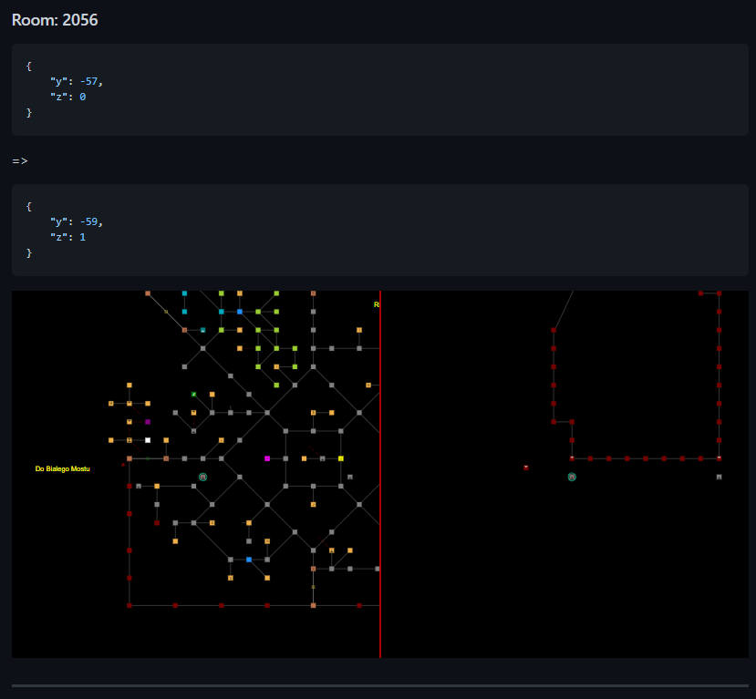

# mudlet-map-diff-action

Github action that allows to compare two Mudlet binary file maps.
It is to be used in pull requests. It will generate comment containing diff for map. If provided with Cloudinary access, it will upload images and post them in comment as well.
So far it requires additional step - checkout base branch as well.

## Usage example

```yml
on: [pull_request_target]

jobs:
  map-diff:
    runs-on: ubuntu-latest
    steps:
      - name: Checkout
        uses: actions/checkout@v2
      - name: Create DIFF
        id: diff
        uses: Delwing/mudlet-map-diff-action@v2
        with:
          old-map: map/map.dat
        env:
          CLOUDINARY_NAME: ${{ secrets.CLOUDINARY_NAME }}
          CLOUDINARY_KEY: ${{ secrets.CLOUDINARY_KEY }}
          CLOUDINARY_SECRET: ${{ secrets.CLOUDINARY_SECRET }}
```

## Additional args:

```yml
    new-map: If new map file has different location in repository use this argument
    tmp-dir: If you need different directory for temp files than `tmp` use this one
```

## Screenshots


