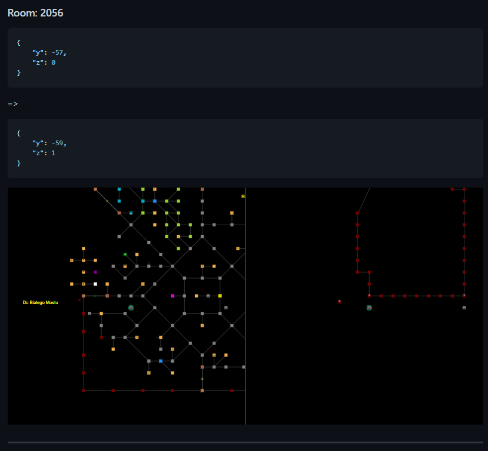

# mudlet-map-diff-action

Github action that allows to compare two Mudlet binary file maps.
It is to be used in pull requests. It will generate a comment containing a diff for the map. If provided with Cloudinary access, it will upload images and post them in the comment as well.
This is a Docker-based action, which means it currently only supports Linux runners (`runs-on: ubuntu-latest`).
It automatically fetches the map files from the base and head branches of the pull request, so no manual checkout is required.

## Usage example

```yml
on: [pull_request, pull_request_target]

jobs:
  map-diff:
    runs-on: ubuntu-latest
    steps:
      - name: Create DIFF
        id: diff
        uses: Delwing/mudlet-map-diff-action@v0.2.0-rc.1
        with:
          old-map: map/map.dat
        env:
          CLOUDINARY_NAME: ${{ secrets.CLOUDINARY_NAME }}
          CLOUDINARY_KEY: ${{ secrets.CLOUDINARY_KEY }}
          CLOUDINARY_SECRET: ${{ secrets.CLOUDINARY_SECRET }}
```

### Permissions

If you use the default `GITHUB_TOKEN`, ensure it has the following permissions:

```yml
permissions:
  contents: read
  pull-requests: write
```

`pull_request_target` is recommended for pull requests from forks if you want the action to be able to post comments.

## Action inputs:

| Name | Description | Default |
| --- | --- | --- |
| `github-token` | `GITHUB_TOKEN` or a `repo` scoped [PAT](https://docs.github.com/en/github/authenticating-to-github/creating-a-personal-access-token). | `GITHUB_TOKEN` |
| `old-map` | Path to map file in repository. | |
| `new-map` | New map file path. Use if differs from `old-map` |  |
| `reuse-comment` | Whether to reuse initial comment. | `false` |
| `collapse-diff` | Whether to collapse diff | `false` |
| `summary` | Whether to output diff to job summary | `true` |

## Action outputs:

| Name | Description |
| --- | --- |
| `diff` | Diff in JSON format |
| `markdown` | Markdown report containing diff and links to Cloudinary (if configured) |

## Screenshots


